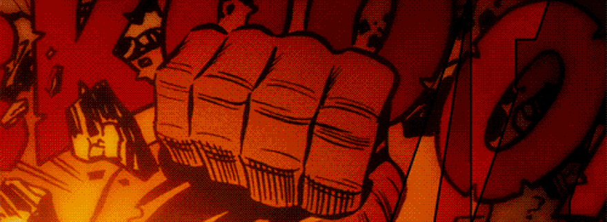

    <h1 align="center">

Desafio KingHost - Assistente de Desenvolvimento
</h1>

## Índice 

- [Sobre](#-Sobre)
- [Tecnologias Utilizadas](#-Tecnologias-Utilizadas)
- [Como Baixar o Projeto](#-Como-Baixar-o-Projeto)
---
## 📝 Sobre

A página **Desafio KingHost - Assitente de Desenvolvimento** foi escrita com o intuito de demonstrar as noções básicas para a posição de Assistente de Desenvolvimento.
- Os requisitos para concluir o projeto podem ser consultados em: **[Desafio](docs/Desafio.pdf)**

___
## 💻 Tecnologias Utilizadas:

O Projeto foi desenvolvido utilizando as seguintes tecnologias: 

- HTML
- [Framework Bootstrap no CSS](https://getbootstrap.com.br/)
- [Biblioteca Jquery para o Javascript](https://code.jquery.com/)
- Ajax Para as Requisições da **[API](https://developer.marvel.com/docs)** previamente disponibilizada no processo de seleção
- [Postman](https://web.postman.co/home) para teste das requisições da **[API](https://developer.marvel.com/docs)**

___
## 📁 Como Baixar o Projeto:

Acessar: 
- https://github.com/Vinibrendel/desafiomarvelkinghost 
- Clonar o projeto
- Entrar na pasta desafiomarvelkinghost
- Duplo clique em index.html
- **OBS:** Caso a abertura dos arquivos com extensão html não esteja vinculada ao navegador de internet padrão, basta seguir os passos abaixo:
- 1- Clicar com o botão direito do mouse sobre o arquivo index.html;
- 2- Na caixa de opções clicar em "abrir com";
- 3- Escolher o navegador de internet da sua preferência previamente instalado ou padrão do Sistema Operacional (ex: Internet Explorer, Safari, Mozilla Firefox).    
___
**Desenvolvido por:** Vinicius Brendel
- **Informações e contato profissional: [Linkedin](https://linkedin.com/in/vinicius-brendel)**
___

